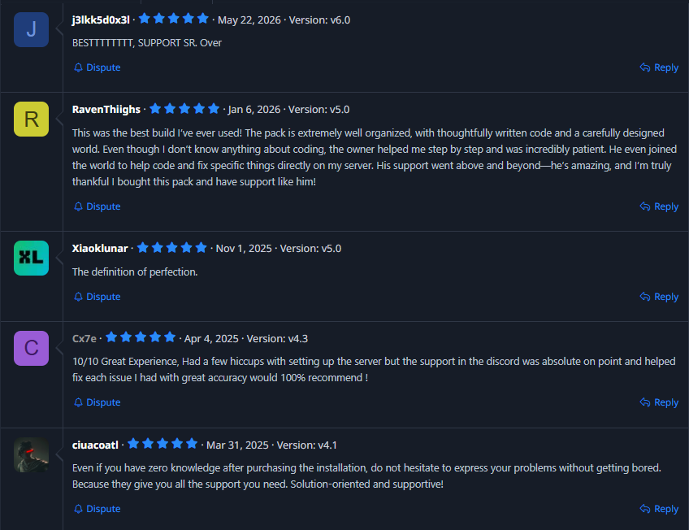

<h1>Hi there 👋, I'm ItzOverWolf</h1>

## 🙋‍♂️ About Me

Hi, I’m an 18-year-old developer focused on backend systems, Minecraft plugin development, and server development. 

I have 5+ years of experience working on public Minecraft Networks and small private SMPs.

I am currently expanding into game development using the Godot engine, actively working on an indie top-down shooter, Defend the Harvest.

I’m also the founder of **Heroic Studios**, a Minecraft-focused development community that creates and sells server-side plugins, mods, complete server setups, and configuration packages.

I have been creating content for Heroic Studios for over 3 years. During that time:
- **My Plugins** have been downloaded 2,000+ times
- **My Free server setups** have reached 60,000+ downloads across Polymart, BuiltByBit, and McSets
- **My Paid setups** have reached 200+ purchases

We focus on making resources that are easy to access, simple to install, and enjoyable to use.
  
## 🚀 My Tech Stack

  
  
  
  
  
  

## ⛏️ Minecraft Stack

  
  
  
  
  
  

---

## ⭐ Reviews

---

## 🔗 Links

- [**BuiltByBit**](https://builtbybit.com/creators/heroic-studios.426046/)
- [**Modrinth**](https://modrinth.com/user/ItzOverWolf)
- [**Polymart**](https://polymart.org/user/artemisstudios.33313)
- [**GitHub**](https://github.com/ItzOverWolf)
- [**YouTube**](https://www.youtube.com/@HeroicStudioss)
- [**Website**](https://wild-trails-development.gitbook.io/heroicstudios)
- [**Discord**](https://discord.gg/XMZuPWkjzE)

